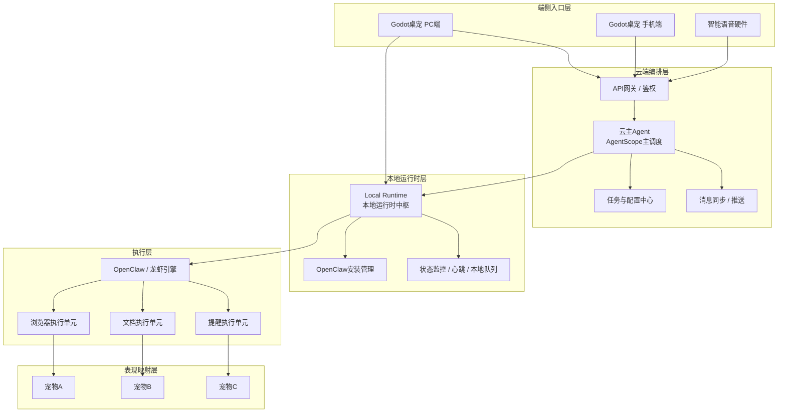

# QQPAL 项目介绍（新版）

## 目录

1. 项目概述
2. 项目定位与收敛方向
3. 核心架构总览
4. 六大核心板块说明
5. 多端协同与任务链路
6. Godot 与 Runtime 的关系
7. OpenClaw 安装与运行机制
8. 项目结构与目录建议
9. MVP 落地路线
10. 项目亮点与阶段目标

---

## 一、项目概述

QQPAL 是一套面向个人用户与轻办公场景的全场景智能数字分身系统，目标不是单独做一个桌宠、单独做一个语音硬件，或者单独做一个云端 AI 工具，而是将：

- **Godot 游戏化桌宠应用**
- **本地 Runtime 运行时**
- **云端主 Agent 调度大脑**
- **基于 OpenClaw 标准的龙虾执行引擎**
- **手机端远程控制入口**
- **智能语音硬件入口**

整合为一套统一的数字分身产品。

QQPAL 的核心价值，在于把“任务理解、任务分发、桌面执行、状态反馈、角色化呈现”打通，让用户既能获得生产力能力，也能获得具备陪伴感、拟人化和游戏化表达的交互体验。

---

## 二、项目定位与收敛方向

结合当前讨论，QQPAL 的新版架构不再一开始就完全依赖“每用户一台云端专属执行主机”，而是收敛为一条更适合 MVP 和产品迭代的主路线：

> **前期以本地执行优先，云端负责任务理解与编排，多端统一接入；后续再扩展到可选云端执行。**

### 1. 当前推荐定位

- **Godot 主应用**：作为桌宠与主交互界面
- **本地 Runtime**：作为用户电脑上的本地运行时中枢
- **云主 Agent**：作为远程编排与多端协调中心
- **OpenClaw 龙虾引擎**：作为真正的桌面执行器
- **手机端**：作为远程控制与通知中心
- **智能硬件**：作为语音入口与状态播报端

### 2. 这样收敛的原因

- 降低前期云资源成本
- 降低系统复杂度
- 优先验证“桌宠 + 本地执行 + 云端调度”的核心闭环
- 更容易体现宠物状态与任务状态的深度联动
- 为后续扩展云端执行版保留接口和架构空间

### 3. 核心原则

- **调度与执行分离**
- **表现层与运行时分离**
- **OpenClaw 执行能力标准化接入**
- **多端统一任务模型**
- **宠物表现与运行状态实时映射**
- **MVP 先本地优先，再逐步全场景扩展**

---

## 三、核心架构总览

新版 QQPAL 更适合采用“前台表现层 + 本地运行时层 + 云端编排层 + 执行引擎层”的四层结构。



### 架构解释

- **端侧入口层**负责接收用户输入、展示结果、进行用户交互
- **云端编排层**负责理解任务、拆解任务、路由任务、同步多端状态，并承担主对话能力
- **本地运行时层**负责连接云端、管理 OpenClaw、处理本地排队与阻塞、上报状态、向 Godot 输出本地事件
- **执行层**负责真正完成桌面操作
- **表现映射层**负责把执行状态映射成宠物角色、动作与情绪

---

## 四、六大核心板块说明

## （一）Godot 主应用

Godot 主应用是 QQPAL 的前台表现层，也是用户最直接接触到的“数字分身界面”。

### 主要职责

- 展示桌宠形象、动作、情绪与多宠物角色
- 提供主应用 UI，包括任务输入、任务查看、安装引导、设置页
- 实时展示任务状态、进度、结果和错误信息
- 呈现 OpenClaw 多执行单元对应的宠物表现
- 作为 PC 端主交互入口，同时支持手机端桌宠复用统一交互体系

### 呈现内容

- 当前在线宠物
- 哪个宠物正在工作
- 哪个任务正在执行
- 执行成功、失败、等待确认的状态
- 文件上传、任务历史、结果摘要

### 定位

> Godot 是 QQPAL 的“脸”和“前台”，负责可视化、游戏化、拟人化表达。

---

## （二）本地 Runtime

本地 Runtime 是运行在用户电脑上的本地业务中枢，可以理解为 Godot 主应用的“本地后端”。

### 主要职责

- 与云主 Agent 建立连接
- 接收云端下发的任务与执行计划
- 监管 OpenClaw 的安装、启动、运行与切换
- 维护本地任务状态、心跳、失败重试与恢复
- 将 OpenClaw 的状态转换为 Godot 可直接消费的事件
- 管理 worker 与宠物之间的映射关系

### 呈现内容

Runtime 本身通常不直接承担复杂 UI，但可提供：

- 连接状态
- 当前引擎状态
- 当前安装版本
- 当前 worker 列表
- 本地错误日志与调试状态

### 定位

> Runtime 是 QQPAL 的“本地运行时中枢”和“本地后端桥梁”。

---

## （三）云主 Agent

云主 Agent 是整个 QQPAL 系统的远程编排大脑，建议基于 AgentScope 搭建。

### 主要职责

- 接收来自 PC、手机、语音硬件的统一任务请求
- 进行自然语言理解和任务拆解
- 管理多用户会话与任务隔离
- 将结构化任务下发给本地 Runtime 或未来的云端执行节点
- 进行多端同步、消息路由和结果汇总
- 承担任务中心、设备中心和策略中心角色

### 呈现内容

云主 Agent 一般不直接作为用户前台 UI，而是通过系统行为间接体现：

- “任务已拆解”
- “任务已转发到本地设备”
- “等待用户补充信息”
- “手机端与桌宠端状态已同步”

### 定位

> 云主 Agent 是 QQPAL 的“全局大脑”和“远程协调中心”。

---

## （四）龙虾引擎 / OpenClaw

OpenClaw 是 QQPAL 的真正执行引擎，负责完成各类桌面操作任务。

### 主要职责

- 打开应用、操作窗口、执行网页任务
- 处理文件、文档、上传下载、消息发送等操作
- 输出执行中间状态、结果、截图、日志
- 提供多个 worker / 执行单元供 Runtime 监管和映射

### 呈现内容

OpenClaw 通常不直接暴露给普通用户，而是通过 Godot 的宠物状态与任务面板进行可视化表达。

### 定位

> OpenClaw 是 QQPAL 的“手脚”和“执行引擎”。

---

## （五）手机端

手机端是 QQPAL 的远程控制入口，而不是主执行端。

### 主要职责

- 远程发任务
- 查看任务状态
- 接收通知和提醒
- 补充任务信息
- 远程确认任务
- 查看电脑设备是否在线

### 呈现内容

- 任务列表
- 任务状态
- 设备在线状态
- 结果摘要
- 通知和确认消息

### 定位

> 手机端是 QQPAL 的“遥控器”和“通知中心”。

---

## （六）智能语音硬件

智能语音硬件是 QQPAL 的轻量物理入口，强调语音触发和状态播报。

### 主要职责

- 唤醒词触发任务
- 发送简单语音指令
- 播报任务结果和提醒
- 承接基础家居控制与轻交互
- 成为数字分身的物理化陪伴入口

### 呈现内容

- 唤醒与语音反馈
- 任务播报
- 提醒与确认
- 执行完成提示

### 定位

> 智能硬件是 QQPAL 的“语音入口”和“结果广播站”。

---

## 五、多端协同与任务链路

QQPAL 的多端协同不是每个端都具备完整执行能力，而是让不同设备承担最合适的角色。

### 1. 电脑端发任务

```text
Godot桌宠 -> 云主Agent -> Runtime -> OpenClaw
OpenClaw -> Runtime -> Godot桌宠
```

适合场景：

- 用户坐在电脑前操作
- 需要可视化观察执行过程
- 需要文件上传、结果查看和多宠物联动
- 对话先在 Godot 与云端之间完成，执行任务再进入 Runtime

### 2. 手机端发任务

```text
手机端 -> 云主Agent -> 本地Runtime -> OpenClaw -> 云主Agent -> 手机端
```

适合场景：

- 用户不在电脑前
- 远程发起任务
- 远程查看进度和结果

### 3. 智能硬件发任务

```text
语音硬件 -> 云主Agent -> 本地Runtime -> OpenClaw -> 云主Agent -> 语音硬件播报
```

适合场景：

- 快捷语音触发
- 生活提醒
- 语音播报结果

### 4. 状态回传链路

```text
OpenClaw -> Runtime -> 云主Agent
OpenClaw -> Runtime -> Godot
```

其中：

- Godot 主要消费本地执行状态和本地运行状态
- 手机端、智能硬件主要通过云端获取任务进度与结果

- Godot 展示详细可视化状态
- 手机端展示远程进度和结果
- 智能硬件负责语音播报和提醒

---

## 六、Godot 与 Runtime 的关系

Godot 主应用与 Runtime 需要紧密协作，但工程上应分层开发。

### 1. 二者关系

- **Godot**：前台、表现层、可视化层
- **Runtime**：本地业务层、本地后端层、桥接层

### 2. 开发原则

- 一起设计
- 分层实现
- 通过接口联调

### 3. 为什么要分层

- 避免 Godot 直接耦合 OpenClaw 细节
- 方便后续把 Runtime 独立成后台服务
- 便于未来支持桌宠关闭后继续后台运行
- 便于统一对接手机端、语音端和未来云执行节点

### 4. 宠物状态映射

Runtime 应把 OpenClaw 的 worker 状态转换为 Godot 的宠物状态，例如：

- `idle -> 待机宠物`
- `planning -> 思考宠物`
- `running -> 忙碌宠物`
- `waiting_user -> 提问宠物`
- `success -> 开心宠物`
- `failed -> 警示/失落宠物`

这样就能实现：

- 一个执行单元对应一个宠物
- 多个执行单元对应多个宠物
- 宠物状态成为任务执行状态的可视化表达

---

## 七、OpenClaw 安装与运行机制

QQPAL 不建议把 OpenClaw 直接打进主安装包，而应采用“平台先安装、引擎后安装”的两阶段方式。

### 1. 安装阶段

主安装包仅包含：

- Godot 主应用
- Runtime 核心模块
- OpenClaw 管理器
- 基础配置和更新模块

### 2. 首次启动阶段

用户首次打开 QQPAL 后：

1. 完成初始化或登录
2. 检查 Runtime 状态
3. 进入 OpenClaw 选择与安装页
4. 选择某个 OpenClaw 版本或厂商实现
5. 由 Runtime 下载、校验、安装并注册
6. 安装完成后纳入统一监管

### 3. 这样做的优点

- 主安装包更轻
- 便于多厂商兼容
- 便于版本切换与升级
- 便于未来多引擎共存
- 便于把不同 worker 与不同宠物角色映射

---

## 八、项目结构与目录建议

下面是一份适合当前路线的项目结构建议。

```text
QQPAL/
├─ docs/
│  ├─ QQPAL项目介绍.MD
│  ├─ architecture.md
│  ├─ runtime-protocol.md
│  └─ mvp-roadmap.md
│
├─ godot-app/
│  ├─ scenes/
│  ├─ scripts/
│  ├─ pets/
│  ├─ ui/
│  └─ assets/
│
├─ runtime-core/
│  ├─ src/
│  │  ├─ cloud/
│  │  ├─ engine/
│  │  ├─ monitor/
│  │  ├─ task/
│  │  ├─ mapping/
│  │  └─ installer/
│  └─ config/
│
├─ openclaw-adapter/
│  ├─ protocols/
│  ├─ drivers/
│  └─ manifests/
│
├─ cloud-agent/
│  ├─ api/
│  ├─ agents/
│  ├─ scheduler/
│  ├─ device-center/
│  ├─ task-center/
│  └─ storage/
│
├─ mobile-app/
│  ├─ ui/
│  ├─ sync/
│  └─ notification/
│
├─ smart-device/
│  ├─ firmware/
│  ├─ protocol/
│  └─ voice-gateway/
│
└─ shared/
   ├─ task-model/
   ├─ device-model/
   ├─ event-model/
   └─ state-enum/
```

### 目录说明

- `godot-app/`：桌宠与前台 UI
- `runtime-core/`：本地 Runtime 核心
- `openclaw-adapter/`：执行引擎对接层
- `cloud-agent/`：云主 Agent 与云端服务
- `mobile-app/`：手机端
- `smart-device/`：智能语音硬件
- `shared/`：共享协议、状态模型和事件枚举

---

## 九、MVP 落地路线

QQPAL 适合按“先闭环、再扩展”的方式推进。

### 阶段 1：本地闭环 MVP

目标：

- Godot 桌宠可提交任务
- 云主 Agent 可拆解任务
- Runtime 可接任务
- OpenClaw 可执行
- Godot 可看到执行状态和结果

### 阶段 2：Runtime 稳定化

目标：

- 增加本地状态管理
- 增加 OpenClaw 安装器
- 增加心跳、失败恢复、版本切换
- 完成宠物状态映射基础能力

### 阶段 3：手机端接入

目标：

- 手机端远程发任务
- 手机端查看任务状态
- 手机端接收通知与确认请求

### 阶段 4：智能硬件接入

目标：

- 语音硬件发起简单任务
- 播报状态与结果
- 打通生活场景提醒链路

### 阶段 5：云端执行扩展

目标：

- 在本地执行优先架构稳定后
- 扩展可选的云端执行节点
- 支持“本地执行 / 云端执行”双模式

---

## 十、项目亮点与阶段目标

### 1. 项目亮点

- **角色化执行表达**：把任务执行状态转成宠物行为与情绪，而不是冰冷的任务条
- **Godot 游戏化交互**：兼顾陪伴感、轻量化与可扩展性
- **本地优先 + 云端协同**：兼顾成本、隐私、响应速度与远程能力
- **OpenClaw 标准兼容**：平台不绑定单一执行系统，保留生态扩展空间
- **多端统一任务体系**：PC、手机、语音硬件共享同一任务模型和状态体系

### 2. 当前阶段目标

当前最适合的阶段目标不是一次性完成全场景产品，而是优先完成以下闭环：

- Godot 桌宠基础交互
- Runtime 本地运行时
- 云主 Agent 任务拆解
- OpenClaw 接入与执行
- 宠物状态与执行状态联动

### 3. 一句话总结

> QQPAL 不是单独的桌宠项目，也不是单独的 AI 助手项目，而是一套以 Godot 数字分身为前台、以 Runtime 为本地中枢、以云主 Agent 为编排大脑、以 OpenClaw 为执行引擎、并联动手机与智能硬件的全场景数字分身系统。
